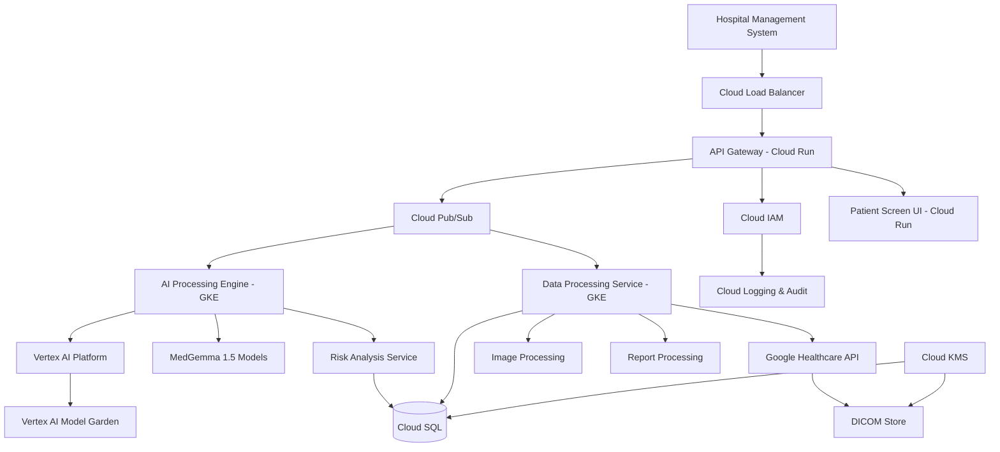

# Design Document: Diagnostic Risk Analyzer

## Overview

The Diagnostic Risk Analyzer is a comprehensive medical AI system that integrates with existing Hospital Management Systems (HMS) to provide automated analysis of medical imaging and reports. The system leverages machine learning models to identify potential health risks, generate clinical suggestions, and enhance diagnostic workflows for healthcare professionals.

The architecture follows a microservices pattern with clear separation between AI processing, data management, HMS integration, and user interface components. The system is designed for high availability, HIPAA compliance, and real-time processing of medical data.

## Architecture

### High-Level Architecture



### Component Architecture

The system consists of six primary components deployed on Google Cloud Platform:

1. **API Gateway (Cloud Run)**: Entry point for all HMS integration and UI requests
2. **AI Processing Engine (GKE + Vertex AI)**: Core AI analysis using MedGemma 1.5 and custom models
3. **Data Processing Service (GKE + Healthcare API)**: Medical imaging and report preprocessing with DICOM support
4. **HMS Connector (Cloud Run)**: Bidirectional integration with hospital systems
5. **Patient Screen Interface (Cloud Run)**: Real-time UI for displaying AI insights
6. **Security & Compliance Layer (Cloud IAM + KMS)**: Authentication, authorization, and audit logging

### GCP Deployment Architecture

The system leverages Google Cloud Platform's healthcare-optimized services:

**Core Infrastructure**:
- **Google Kubernetes Engine (GKE)**: Auto-scaling container orchestration for AI processing workloads
- **Cloud Run**: Serverless containers for API Gateway, HMS Connector, and UI components
- **Cloud Load Balancer**: Global load balancing with health checks and SSL termination
- **Cloud Pub/Sub**: Asynchronous message queuing for decoupled processing

**AI and ML Services**:
- **Vertex AI Platform**: Managed ML platform for model deployment and inference
- **MedGemma 1.5**: Specialized medical AI models for CT, MRI, X-ray, and histopathology analysis
- **Vertex AI Model Garden**: Pre-trained model repository and custom model deployment
- **AutoML**: Custom model training and fine-tuning on medical datasets

**Healthcare-Specific Services**:
- **Google Healthcare API**: FHIR, HL7, and DICOM data management with built-in compliance
- **DICOM Store**: Secure storage and retrieval of medical imaging data
- **FHIR Store**: Structured healthcare data storage following industry standards

**Data and Storage**:
- **Cloud SQL (PostgreSQL)**: HIPAA-compliant relational database for patient data and analysis results
- **Cloud Storage**: Encrypted object storage for medical images and model artifacts
- **Firestore**: Real-time database for UI state and user sessions

**Security and Compliance**:
- **Cloud Identity and Access Management (IAM)**: Fine-grained access control and role management
- **Cloud Key Management Service (KMS)**: Encryption key management for data at rest
- **Cloud Security Command Center**: Centralized security monitoring and compliance reporting
- **VPC Service Controls**: Network-level security perimeters for sensitive data

**Cost Optimization Features**:
- **Preemptible VM instances**: Up to 80% cost savings for training workloads
- **Auto-scaling**: Dynamic resource allocation based on demand
- **Committed Use Discounts**: Long-term pricing for predictable workloads
- **Regional deployment**: Optimized for cost-effective data processing and storage

## Components and Interfaces

### API Gateway (Cloud Run)

**Purpose**: Central entry point deployed on Cloud Run for automatic scaling and cost optimization, handling authentication, rate limiting, and request routing.

**Key Interfaces**:
```typescript
interface APIGateway {
  // HMS Integration
  processPatientData(patientId: string, medicalData: MedicalData): Promise<AnalysisResult>
  retrieveAnalysisResults(patientId: string): Promise<AnalysisResult[]>
  
  // Real-time Updates via Pub/Sub
  subscribeToPatientUpdates(patientId: string): WebSocketConnection
  
  // Cloud IAM Authentication
  authenticateUser(credentials: UserCredentials): Promise<AuthToken>
  validateAccess(token: AuthToken, resource: string): Promise<boolean>
}
```

**GCP Integration**:
- **Cloud Run**: Serverless deployment with automatic scaling to zero
- **Cloud IAM**: Integration for user authentication and role-based access
- **Cloud Pub/Sub**: Message publishing for asynchronous processing
- **Cloud Load Balancer**: Global load balancing with SSL termination

**Responsibilities**:
- Request authentication via Cloud IAM
- Rate limiting and throttling with Cloud Armor
- Request routing to GKE services via Pub/Sub
- Response aggregation and formatting
- WebSocket management for real-time updates

### AI Processing Engine (GKE + Vertex AI)

**Purpose**: Core AI analysis system deployed on GKE that leverages Vertex AI and MedGemma 1.5 for medical data processing and diagnostic insights.

**Key Interfaces**:
```typescript
interface AIProcessingEngine {
  // MedGemma 1.5 Integration
  analyzeMedicalImaging(imageData: MedicalImage): Promise<MedGemmaAnalysis>
  processHistopathology(slideData: HistopathologyImage): Promise<PathologyAnalysis>
  analyzeCTScan(ctData: CTScanData): Promise<CTAnalysis>
  processMRI(mriData: MRIData): Promise<MRIAnalysis>
  
  // Vertex AI Model Garden
  deployCustomModel(modelConfig: ModelConfiguration): Promise<ModelEndpoint>
  generateRiskAssessment(analysisData: AnalysisData): Promise<RiskAssessment>
  correlateFindings(multiModalData: MedicalData[]): Promise<CorrelatedAnalysis>
}

interface MedGemmaAnalysis {
  findings: MedicalFinding[]
  confidence: number
  anatomicalAnnotations: ImageAnnotation[]
  processingTime: number
  modelVersion: string
  specialtyInsights: SpecialtyInsight[]
}

interface RiskAssessment {
  riskLevel: 'Low' | 'Medium' | 'High' | 'Critical'
  riskFactors: RiskFactor[]
  clinicalSuggestions: ClinicalSuggestion[]
  urgencyScore: number
  evidenceQuality: number
}
```

**GCP Integration**:
- **Google Kubernetes Engine (GKE)**: Auto-scaling container orchestration with preemptible instances for cost optimization
- **Vertex AI Platform**: Managed ML platform for model serving and inference
- **MedGemma 1.5**: Specialized medical AI models for:
  - CT scan analysis with 3D volumetric processing
  - MRI analysis with multi-sequence correlation
  - X-ray analysis with bone and soft tissue detection
  - Histopathology analysis with cellular-level insights
- **Vertex AI Model Garden**: Access to pre-trained medical models and custom model deployment
- **AutoML**: Custom fine-tuning on hospital-specific datasets

**Cost Optimization**:
- **Preemptible VM instances**: 80% cost reduction for training workloads
- **Auto-scaling**: Dynamic scaling based on processing queue depth
- **Batch processing**: Optimized inference batching for improved throughput
- **Regional deployment**: Data locality to minimize egress costs

**Responsibilities**:
- Medical imaging analysis using MedGemma 1.5 specialized models
- Multi-modal medical data correlation and analysis
- Risk assessment calculation with clinical evidence
- Custom model training and fine-tuning
- Real-time and batch processing optimization

### Data Processing Service (GKE + Healthcare API)

**Purpose**: Preprocessing and validation of medical data using Google Healthcare API for DICOM support and HIPAA compliance.

**Key Interfaces**:
```typescript
interface DataProcessingService {
  // Google Healthcare API Integration
  processDICOMData(dicomData: DICOMImage): Promise<ProcessedDICOMImage>
  validateFHIRData(fhirData: FHIRResource): Promise<ValidationResult>
  
  // Image Processing
  validateImageQuality(image: MedicalImage): Promise<QualityAssessment>
  preprocessImage(image: MedicalImage): Promise<ProcessedImage>
  convertDICOMToStandard(dicomImage: DICOMImage): Promise<StandardImage>
  
  // Report Processing
  extractReportData(report: MedicalReport): Promise<StructuredData>
  anonymizeData(patientData: PatientData): Promise<AnonymizedData>
}

interface ProcessedDICOMImage {
  imageData: Buffer
  metadata: DICOMMetadata
  qualityScore: number
  preprocessingApplied: string[]
  complianceFlags: ComplianceFlag[]
}

interface QualityAssessment {
  isAcceptable: boolean
  qualityScore: number
  issues: QualityIssue[]
  requiresManualReview: boolean
  dicomCompliance: boolean
}
```

**GCP Integration**:
- **Google Healthcare API**: HIPAA-compliant DICOM, FHIR, and HL7 data processing
- **DICOM Store**: Secure storage and retrieval of medical imaging with built-in compliance
- **FHIR Store**: Structured healthcare data following industry standards
- **Cloud Storage**: Encrypted storage for processed images and metadata
- **GKE**: Container orchestration for scalable image processing workloads

**Healthcare API Features**:
- **DICOM Web**: RESTful API for DICOM data access and manipulation
- **De-identification**: Automated PHI removal and anonymization
- **Audit Logging**: Comprehensive access logging for compliance
- **Data Validation**: Built-in validation for healthcare data standards

**Responsibilities**:
- DICOM image quality validation and preprocessing
- FHIR data validation and standardization
- Medical report parsing with Healthcare API
- Patient data anonymization and de-identification
- Compliance validation and audit trail generation

### HMS Connector (Cloud Run)

**Purpose**: Bidirectional integration with existing Hospital Management Systems using Cloud Run for cost-effective scaling.

**Key Interfaces**:
```typescript
interface HMSConnector {
  // Cloud SQL Integration
  retrievePatientData(patientId: string): Promise<PatientData>
  submitAnalysisResults(patientId: string, results: AnalysisResult): Promise<void>
  
  // Pub/Sub Integration
  subscribeToDataUpdates(): EventStream<PatientDataUpdate>
  publishAnalysisComplete(analysisId: string): Promise<void>
  
  // Offline Resilience
  syncQueuedResults(): Promise<SyncResult>
  handleConnectivityLoss(): Promise<void>
}

interface PatientData {
  patientId: string
  demographics: Demographics
  medicalHistory: MedicalHistory
  currentSymptoms: Symptom[]
  medications: Medication[]
  imaging: MedicalImage[]
  reports: MedicalReport[]
  fhirData?: FHIRResource[]
}
```

**GCP Integration**:
- **Cloud Run**: Serverless deployment with automatic scaling and pay-per-use pricing
- **Cloud SQL**: HIPAA-compliant PostgreSQL database for patient data caching
- **Cloud Pub/Sub**: Asynchronous messaging for real-time HMS integration
- **Cloud Scheduler**: Automated synchronization and data refresh jobs
- **Secret Manager**: Secure storage of HMS API credentials and connection strings

**Cost Optimization**:
- **Serverless scaling**: Pay only for actual request processing time
- **Connection pooling**: Efficient database connection management
- **Caching strategy**: Reduced HMS API calls through intelligent caching

**Responsibilities**:
- Real-time data synchronization with HMS via secure APIs
- Patient data retrieval and intelligent caching in Cloud SQL
- Analysis result submission with retry logic
- Offline queue management using Pub/Sub
- HIPAA-compliant data handling and audit logging

### Patient Screen Interface (Cloud Run)

**Purpose**: Real-time user interface deployed on Cloud Run for displaying AI insights within the HMS patient view with automatic scaling.

**Key Interfaces**:
```typescript
interface PatientScreenInterface {
  // Firestore Integration
  displayAnalysisResults(patientId: string): Promise<void>
  updateRealTime(analysisUpdate: AnalysisUpdate): void
  
  // Cloud Pub/Sub Integration
  subscribeToAnalysisUpdates(patientId: string): WebSocketConnection
  
  // User Interaction
  handleDoctorFeedback(feedback: DoctorFeedback): Promise<void>
  showAnnotatedImages(imageAnalysis: MedGemmaAnalysis): void
}

interface DoctorFeedback {
  suggestionId: string
  action: 'accept' | 'reject' | 'modify'
  modifications?: string
  reasoning?: string
  timestamp: Date
  userId: string
}
```

**GCP Integration**:
- **Cloud Run**: Serverless frontend hosting with automatic scaling
- **Firestore**: Real-time database for UI state synchronization
- **Cloud Pub/Sub**: Real-time updates via WebSocket connections
- **Cloud CDN**: Global content delivery for fast image loading
- **Cloud IAM**: User authentication and role-based UI access

**Real-time Features**:
- **WebSocket connections**: Live updates via Cloud Pub/Sub
- **Firestore listeners**: Real-time UI state synchronization
- **Progressive loading**: Optimized image annotation display

**Responsibilities**:
- Real-time display of MedGemma 1.5 analysis results
- Interactive medical image annotation display
- Doctor feedback collection and validation
- Analysis history management with Firestore
- Responsive UI updates with minimal latency

### Security & Compliance Layer (Cloud IAM + KMS)

**Purpose**: Comprehensive security, authentication, and compliance management using Google Cloud's healthcare-optimized security services.

**Key Interfaces**:
```typescript
interface SecurityLayer {
  // Cloud IAM Integration
  authenticateUser(credentials: UserCredentials): Promise<AuthResult>
  authorizeAccess(user: User, resource: string, action: string): Promise<boolean>
  
  // Cloud KMS Integration
  encryptData(data: any, keyId: string): Promise<EncryptedData>
  decryptData(encryptedData: EncryptedData, keyId: string): Promise<any>
  
  // Healthcare API Compliance
  auditLog(action: AuditAction): Promise<void>
  anonymizeForResearch(patientData: PatientData): Promise<AnonymizedData>
  validateHIPAACompliance(operation: Operation): Promise<ComplianceResult>
}

interface AuditAction {
  userId: string
  action: string
  resource: string
  timestamp: Date
  ipAddress: string
  result: 'success' | 'failure'
  complianceFlags: string[]
}

interface ComplianceResult {
  isCompliant: boolean
  violations: ComplianceViolation[]
  recommendations: string[]
  auditTrail: AuditEntry[]
}
```

**GCP Security Integration**:
- **Cloud Identity and Access Management (IAM)**: Fine-grained role-based access control
- **Cloud Key Management Service (KMS)**: Hardware security module (HSM) backed encryption
- **VPC Service Controls**: Network-level security perimeters for sensitive data
- **Cloud Security Command Center**: Centralized security monitoring and threat detection
- **Binary Authorization**: Container image security and policy enforcement

**Healthcare Compliance Features**:
- **HIPAA compliance**: Built-in compliance with Google Healthcare API
- **BAA coverage**: Business Associate Agreement for healthcare data
- **Audit logging**: Comprehensive access and operation logging
- **Data residency**: Regional data storage controls
- **Encryption**: End-to-end encryption with customer-managed keys

**Advanced Security**:
- **Identity-Aware Proxy (IAP)**: Zero-trust access control
- **Cloud Armor**: DDoS protection and web application firewall
- **Certificate Authority Service**: Private CA for internal certificates
- **Secret Manager**: Secure credential and API key management

**Responsibilities**:
- User authentication via Cloud IAM with multi-factor authentication
- Role-based access control with healthcare-specific roles
- Data encryption at rest and in transit using Cloud KMS
- Comprehensive audit logging for HIPAA compliance
- Automated compliance monitoring and reporting
- Data retention and secure purging according to healthcare regulations

## Data Models

### Core Medical Data Models

```typescript
// GCP Healthcare API Integration
interface DICOMImage extends MedicalImage {
  dicomMetadata: DICOMMetadata
  studyInstanceUID: string
  seriesInstanceUID: string
  sopInstanceUID: string
  transferSyntax: string
  complianceLevel: 'strict' | 'relaxed'
}

interface DICOMMetadata {
  patientName: string
  patientID: string
  studyDate: string
  modality: string
  bodyPartExamined: string
  viewPosition: string
  institutionName: string
  manufacturerModelName: string
  pixelSpacing: number[]
  sliceThickness?: number
}

interface MedicalImage {
  imageId: string
  patientId: string
  imageType: 'xray' | 'ct' | 'ecg' | 'mri' | 'histopathology'
  imageData: Buffer
  metadata: ImageMetadata
  timestamp: Date
  qualityScore?: number
  gcpStoragePath: string // Cloud Storage path
  dicomCompliant: boolean
}

interface ImageMetadata {
  resolution: { width: number; height: number }
  bitDepth: number
  compressionType: string
  acquisitionParameters: Record<string, any>
  bodyPart: string
  viewPosition: string
  medGemmaCompatible: boolean // MedGemma 1.5 compatibility flag
}

// FHIR Integration for Healthcare API
interface FHIRResource {
  resourceType: string
  id: string
  meta: FHIRMeta
  identifier: FHIRIdentifier[]
  subject: FHIRReference
  effectiveDateTime: string
  valueQuantity?: FHIRQuantity
  component?: FHIRComponent[]
}

interface FHIRMeta {
  versionId: string
  lastUpdated: string
  profile: string[]
  security: FHIRCoding[]
}

interface MedicalReport {
  reportId: string
  patientId: string
  reportType: 'lab' | 'pathology' | 'radiology' | 'clinical'
  content: string
  structuredData?: Record<string, any>
  fhirResource?: FHIRResource // Healthcare API integration
  authorId: string
  timestamp: Date
  status: 'draft' | 'final' | 'amended'
  complianceFlags: string[]
}

// MedGemma 1.5 Specific Models
interface MedGemmaFinding extends Finding {
  medGemmaConfidence: number
  specialtyInsight: SpecialtyInsight
  anatomicalRegion: AnatomicalRegion
  clinicalSignificance: ClinicalSignificance
}

interface SpecialtyInsight {
  specialty: 'radiology' | 'pathology' | 'cardiology' | 'oncology'
  findings: string[]
  recommendations: string[]
  urgencyLevel: number
  literatureReferences: Reference[]
}

interface Finding {
  findingId: string
  description: string
  location: AnatomicalLocation
  severity: 'mild' | 'moderate' | 'severe'
  confidence: number
  evidenceReferences: string[]
  medGemmaGenerated: boolean // Flag for MedGemma 1.5 generated findings
}

interface AnatomicalLocation {
  organ: string
  region: string
  coordinates?: { x: number; y: number; z?: number }
  boundingBox?: BoundingBox
  dicomCoordinates?: DICOMCoordinates // DICOM-specific coordinate system
}

interface DICOMCoordinates {
  imagePositionPatient: number[]
  imageOrientationPatient: number[]
  pixelSpacing: number[]
  sliceLocation?: number
}
```

### Analysis Result Models

```typescript
interface AnalysisResult {
  analysisId: string
  patientId: string
  timestamp: Date
  analysisType: 'imaging' | 'report' | 'combined'
  findings: MedGemmaFinding[] // Enhanced with MedGemma 1.5 insights
  riskAssessment: RiskAssessment
  clinicalSuggestions: ClinicalSuggestion[]
  processingMetrics: ProcessingMetrics
  status: 'pending' | 'completed' | 'failed'
  vertexAIModelUsed: string // Vertex AI model identifier
  gcpProcessingRegion: string // GCP region for compliance
}

interface RiskFactor {
  factorId: string
  name: string
  category: 'cardiovascular' | 'respiratory' | 'neurological' | 'oncological' | 'other'
  severity: number // 1-10 scale
  evidence: Evidence[]
  interactions: string[] // IDs of related risk factors
  medGemmaGenerated: boolean
  clinicalValidation: ValidationStatus
}

interface ClinicalSuggestion {
  suggestionId: string
  type: 'diagnostic' | 'therapeutic' | 'monitoring'
  priority: 'low' | 'medium' | 'high' | 'urgent'
  description: string
  rationale: string
  literatureReferences: Reference[]
  contraindications?: string[]
  medGemmaConfidence: number
  specialtyRecommendation: SpecialtyInsight
}

interface ProcessingMetrics {
  processingTime: number
  modelVersion: string
  confidenceDistribution: Record<string, number>
  resourceUsage: GCPResourceUsage
  vertexAIEndpoint: string
  costEstimate: CostBreakdown
}

interface GCPResourceUsage {
  computeUnits: number
  memoryUsage: number
  storageAccessed: number
  networkEgress: number
  vertexAIPredictions: number
}

interface CostBreakdown {
  computeCost: number
  storageCost: number
  networkCost: number
  vertexAICost: number
  totalCost: number
  currency: string
}
```

### System Models

```typescript
interface User {
  userId: string
  username: string
  role: 'doctor' | 'nurse' | 'admin' | 'researcher'
  permissions: Permission[]
  department: string
  lastLogin: Date
  gcpIAMRole: string // Cloud IAM role mapping
  mfaEnabled: boolean
}

interface Permission {
  resource: string
  actions: string[]
  conditions?: Record<string, any>
  gcpIAMBinding: string // IAM policy binding
}

interface ModelConfiguration {
  modelId: string
  modelType: 'imaging' | 'nlp' | 'risk_assessment'
  version: string
  parameters: Record<string, any>
  performanceMetrics: ModelMetrics
  deploymentStatus: 'active' | 'staging' | 'deprecated'
  vertexAIEndpoint: string // Vertex AI model endpoint
  medGemmaVersion?: string // MedGemma 1.5 version if applicable
  gcpRegion: string
  costPerPrediction: number
}

interface GCPDeploymentConfig {
  projectId: string
  region: string
  zone: string
  gkeClusterName: string
  cloudRunServices: CloudRunService[]
  vertexAIModels: VertexAIModel[]
  healthcareDatasets: HealthcareDataset[]
  costOptimization: CostOptimizationConfig
}

interface CloudRunService {
  serviceName: string
  image: string
  minInstances: number
  maxInstances: number
  cpuLimit: string
  memoryLimit: string
  environmentVariables: Record<string, string>
}

interface VertexAIModel {
  displayName: string
  modelId: string
  endpointId: string
  trafficSplit: Record<string, number>
  machineType: string
  acceleratorType?: string
  acceleratorCount?: number
}

interface HealthcareDataset {
  datasetId: string
  location: string
  dicomStores: DICOMStore[]
  fhirStores: FHIRStore[]
  hl7V2Stores: HL7V2Store[]
}

interface CostOptimizationConfig {
  usePreemptibleInstances: boolean
  autoScalingEnabled: boolean
  scheduledScaling: ScheduledScaling[]
  commitmentDiscounts: CommitmentDiscount[]
  regionOptimization: RegionOptimization
}

interface ScheduledScaling {
  schedule: string // Cron expression
  minReplicas: number
  maxReplicas: number
  targetCPUUtilization: number
}
```
## GCP Cost Optimization and MedGemma 1.5 Advantages

### Cost Optimization Strategies

**Compute Cost Reduction**:
- **Preemptible VM Instances**: Up to 80% cost savings for training workloads and batch processing
- **Auto-scaling**: Dynamic resource allocation based on processing queue depth and time-of-day patterns
- **Spot Instances**: Additional cost savings for fault-tolerant workloads
- **Committed Use Discounts**: 1-year and 3-year commitments for predictable workloads with up to 57% savings

**Storage Optimization**:
- **Intelligent Tiering**: Automatic data lifecycle management moving cold data to cheaper storage classes
- **Regional Storage**: Optimized data locality to minimize egress costs and improve performance
- **Compression**: DICOM image compression without quality loss for storage cost reduction
- **Data Deduplication**: Eliminate redundant medical images and reports

**Network Cost Management**:
- **Regional Deployment**: Co-locate compute and storage in the same region
- **CDN Integration**: Cloud CDN for global image delivery with edge caching
- **Private Google Access**: Avoid egress charges for internal GCP service communication
- **VPC Peering**: Efficient network connectivity between services

**AI/ML Cost Optimization**:
- **Batch Prediction**: Process multiple images simultaneously for better resource utilization
- **Model Caching**: Cache frequently used MedGemma 1.5 model predictions
- **Right-sizing**: Match compute resources to actual model requirements
- **Scheduled Training**: Run training jobs during off-peak hours for lower costs

### MedGemma 1.5 Competitive Advantages

**Medical Specialization**:
- **Purpose-built for Healthcare**: Unlike general-purpose AI models, MedGemma 1.5 is specifically trained on medical imaging datasets
- **Multi-modal Analysis**: Native support for CT, MRI, X-ray, and histopathology in a single model
- **Clinical Accuracy**: Higher diagnostic accuracy compared to adapted general-purpose models
- **Regulatory Alignment**: Designed with healthcare compliance and FDA considerations

**Cost-Effectiveness**:
- **Reduced Training Costs**: Pre-trained on medical data, requiring minimal fine-tuning for specific use cases
- **Faster Inference**: Optimized for medical imaging with lower computational requirements
- **Fewer False Positives**: Higher precision reduces unnecessary follow-up procedures and costs
- **Integrated Workflow**: Seamless integration with Google Healthcare API reduces development costs

**Technical Advantages**:
- **DICOM Native**: Built-in support for DICOM format without preprocessing overhead
- **Anatomical Understanding**: Deep understanding of human anatomy and pathology
- **Multi-language Support**: Clinical terminology in multiple languages
- **Continuous Updates**: Regular model updates with latest medical research

**Competitive Pricing**:
- **Pay-per-Prediction**: No upfront costs, pay only for actual usage
- **Volume Discounts**: Automatic pricing tiers for high-volume usage
- **Regional Pricing**: Optimized pricing for different geographic regions
- **Bundled Services**: Cost savings when combined with other GCP healthcare services

### Regional Deployment Recommendations

**Primary Regions for Healthcare**:
- **us-central1 (Iowa)**: Lowest cost, high availability, HIPAA compliant
- **us-east4 (Northern Virginia)**: Close to major healthcare systems, good network connectivity
- **europe-west4 (Netherlands)**: GDPR compliant, serves European healthcare markets
- **asia-southeast1 (Singapore)**: Serves APAC healthcare markets with data residency compliance

**Multi-region Strategy**:
- **Active-Active**: Deploy in multiple regions for disaster recovery and load distribution
- **Data Residency**: Ensure patient data remains in required geographic boundaries
- **Latency Optimization**: Choose regions closest to hospital systems for minimal latency
- **Compliance Alignment**: Select regions that meet specific healthcare regulatory requirements

## Correctness Properties

*A property is a characteristic or behavior that should hold true across all valid executions of a system—essentially, a formal statement about what the system should do. Properties serve as the bridge between human-readable specifications and machine-verifiable correctness guarantees.*

Based on the prework analysis, I've identified properties that can be combined and consolidated to eliminate redundancy. Several properties around data handling, processing, and validation can be unified into more comprehensive properties that provide better coverage.

### Property 1: Medical Image Processing Performance
*For any* valid medical image (X-ray, CT scan, ECG), the processing time should be less than or equal to 30 seconds
**Validates: Requirements 1.1**

### Property 2: Analysis Output Completeness
*For any* medical image processed by the Diagnostic Engine, the output should contain identified anatomical structures and potential abnormalities with proper structure
**Validates: Requirements 1.2**

### Property 3: Confidence Score Bounds
*For any* analysis result containing findings, all confidence scores should be within the range 0-100 inclusive
**Validates: Requirements 1.3**

### Property 4: Multi-Modal Correlation
*For any* set of multiple imaging types for the same patient, the correlation analysis should reference all input modalities
**Validates: Requirements 1.4**

### Property 5: Quality Assessment Flagging
*For any* medical image with insufficient quality, the system should flag it as requiring manual review
**Validates: Requirements 1.5**

### Property 6: Report Data Extraction
*For any* valid medical report, the system should extract structured clinical findings and measurements
**Validates: Requirements 2.1**

### Property 7: Medication Interaction Detection
*For any* set of medications in a patient's record, the system should identify known interactions and contraindications
**Validates: Requirements 2.2**

### Property 8: Temporal Analysis Tracking
*For any* sequence of historical reports for a patient, the system should identify and track changes in condition over time
**Validates: Requirements 2.3**

### Property 9: Report Format Parsing
*For any* valid structured or unstructured medical report format, the system should successfully parse and extract data
**Validates: Requirements 2.4**

### Property 10: Error Handling and Logging
*For any* invalid input that causes parsing failure, the system should log the error and request manual intervention
**Validates: Requirements 2.5**

### Property 11: Patient Data Retrieval
*For any* valid patient ID accessed in HMS, the HMS Connector should retrieve all relevant AI analysis results
**Validates: Requirements 3.1**

### Property 12: Automatic Analysis Triggering
*For any* new medical data added to HMS, the system should automatically trigger appropriate AI analysis
**Validates: Requirements 3.2**

### Property 13: Data Privacy and Encryption
*For any* patient data processed by the system, it should be encrypted in transit and at rest, with all access properly logged
**Validates: Requirements 3.3, 7.1, 7.2**

### Property 14: Offline Queue Management
*For any* analysis result generated when HMS is unavailable, it should be queued and synchronized when HMS becomes available
**Validates: Requirements 3.4**

### Property 15: Risk Categorization
*For any* completed analysis, all identified risks should be categorized as Low, Medium, High, or Critical
**Validates: Requirements 4.1**

### Property 16: High-Risk Alert Generation
*For any* analysis identifying High or Critical risks, immediate alerts should be generated
**Validates: Requirements 4.2**

### Property 17: Clinical Suggestion References
*For any* clinical suggestion provided by the system, it should include relevant medical literature references
**Validates: Requirements 4.3**

### Property 18: Comprehensive Risk Analysis
*For any* risk assessment, it should incorporate patient demographics, medical history, and current symptoms
**Validates: Requirements 4.4**

### Property 19: Risk Prioritization
*For any* analysis with multiple risk factors, they should be prioritized by clinical urgency
**Validates: Requirements 4.5**

### Property 20: UI Analysis Display
*For any* patient record with AI analysis results, they should be displayed in the dedicated Patient Screen section
**Validates: Requirements 5.1**

### Property 21: Real-Time UI Updates
*For any* new analysis becoming available, the Patient Screen should update in real-time without requiring page refresh
**Validates: Requirements 5.2**

### Property 22: Doctor Feedback Handling
*For any* AI suggestion displayed to doctors, they should be able to accept, reject, or modify it through the interface
**Validates: Requirements 5.3**

### Property 23: Image Annotation Display
*For any* imaging analysis result, annotated images with highlighted findings should be properly displayed
**Validates: Requirements 5.4**

### Property 24: Interaction History Maintenance
*For any* AI recommendation and doctor response, it should be stored and retrievable in the system history
**Validates: Requirements 5.5**

### Property 25: Feedback Storage
*For any* doctor feedback on AI suggestions, the validation data should be properly stored for model improvement
**Validates: Requirements 6.1**

### Property 26: Model Retraining Trigger
*For any* collection of sufficient validated feedback data, model retraining should be automatically triggered
**Validates: Requirements 6.2**

### Property 27: Model Training Support
*For any* ECG or X-ray analysis model, the system should support fine-tuning using existing training scripts
**Validates: Requirements 6.3**

### Property 28: Backward Compatibility
*For any* new model deployment, it should maintain compatibility with existing data formats and structures
**Validates: Requirements 6.4**

### Property 29: Performance Metrics Tracking
*For any* deployed model, performance metrics and accuracy improvements should be tracked over time
**Validates: Requirements 6.5**

### Property 30: Role-Based Access Control
*For any* user attempting to access system resources, access should be granted only if appropriate for their role
**Validates: Requirements 7.3**

### Property 31: Automated Data Purging
*For any* patient data reaching its retention period expiration, it should be automatically purged from the system
**Validates: Requirements 7.4**

### Property 32: Data Anonymization
*For any* patient data used for research or training, it should be properly anonymized to remove identifying information
**Validates: Requirements 7.5**

### Property 33: Concurrent Processing Capability
*For any* set of up to 100 concurrent imaging analysis requests, the system should process them without performance degradation
**Validates: Requirements 8.1**

### Property 34: Load Management and Queuing
*For any* high system load condition, requests should be queued with estimated processing times provided
**Validates: Requirements 8.2**

### Property 35: Graceful Degradation
*For any* critical component failure, the system should gracefully degrade functionality and alert administrators
**Validates: Requirements 8.4**

### Property 36: Non-Disruptive Backup Operations
*For any* backup and recovery operation, it should complete without affecting user access to the system
**Validates: Requirements 8.5**

## Error Handling

### Error Categories

The system handles five primary categories of errors in the GCP environment:

1. **Input Validation Errors**: Invalid or corrupted medical data, DICOM compliance issues
2. **Processing Errors**: Vertex AI model failures, MedGemma 1.5 inference errors, resource constraints
3. **Integration Errors**: HMS connectivity, Healthcare API issues, synchronization problems
4. **Infrastructure Errors**: GKE cluster issues, Cloud Run cold starts, network connectivity
5. **Security Errors**: IAM authentication failures, KMS encryption issues, compliance violations

### GCP-Specific Error Handling Strategies

**Healthcare API Error Handling**:
- **DICOM Validation Errors**: Automatic retry with relaxed compliance settings
- **FHIR Resource Errors**: Graceful degradation with partial data processing
- **De-identification Failures**: Fallback to manual anonymization workflows
- **Quota Exceeded**: Automatic request queuing with exponential backoff

**Vertex AI Error Handling**:
- **Model Endpoint Unavailable**: Automatic failover to backup model versions
- **Prediction Timeout**: Batch processing fallback for large images
- **Resource Exhaustion**: Auto-scaling trigger and request queuing
- **Model Version Conflicts**: Automatic rollback to stable model versions

**GKE and Cloud Run Resilience**:
- **Pod Failures**: Automatic pod restart with health checks
- **Node Unavailability**: Workload migration to healthy nodes
- **Cold Start Delays**: Minimum instance configuration for Cloud Run services
- **Resource Limits**: Horizontal pod autoscaling based on CPU and memory usage

**Cloud SQL and Storage Errors**:
- **Database Connection Failures**: Connection pooling with automatic retry
- **Storage Quota Exceeded**: Automatic data archival to cheaper storage tiers
- **Backup Failures**: Multi-region backup redundancy
- **Data Corruption**: Point-in-time recovery with transaction log replay

### Error Response Patterns

```typescript
interface GCPErrorResponse extends ErrorResponse {
  errorCode: string
  errorMessage: string
  errorCategory: 'validation' | 'processing' | 'integration' | 'infrastructure' | 'security'
  severity: 'low' | 'medium' | 'high' | 'critical'
  recoveryAction: string
  timestamp: Date
  correlationId: string
  gcpService: string // Which GCP service generated the error
  region: string
  retryable: boolean
  estimatedRetryDelay?: number
}

interface HealthcareAPIError extends GCPErrorResponse {
  dicomValidationErrors?: DICOMValidationError[]
  fhirValidationErrors?: FHIRValidationError[]
  complianceViolations?: ComplianceViolation[]
}

interface VertexAIError extends GCPErrorResponse {
  modelEndpoint: string
  modelVersion: string
  predictionId: string
  resourceExhausted: boolean
  quotaExceeded: boolean
}
```

### Monitoring and Alerting

**Cloud Monitoring Integration**:
- **Custom Metrics**: Medical image processing latency, diagnostic accuracy rates
- **SLI/SLO Monitoring**: Service level indicators for critical healthcare workflows
- **Error Rate Tracking**: Real-time error rate monitoring with automatic alerting
- **Resource Utilization**: CPU, memory, and storage utilization across all services

**Cloud Logging**:
- **Structured Logging**: JSON-formatted logs for easy parsing and analysis
- **Audit Trail**: Comprehensive logging for HIPAA compliance requirements
- **Error Correlation**: Distributed tracing across microservices
- **Log-based Metrics**: Custom metrics derived from log patterns

**Alerting Policies**:
- **Critical Errors**: Immediate PagerDuty alerts for system failures
- **Performance Degradation**: Slack notifications for SLO violations
- **Security Incidents**: Email alerts for authentication failures or data breaches
- **Cost Anomalies**: Budget alerts for unexpected cost increases

## Testing Strategy

### Dual Testing Approach

The system employs both unit testing and property-based testing to ensure comprehensive coverage in the GCP environment:

**Unit Tests**:
- Specific examples of DICOM image processing with Healthcare API
- Edge cases for MedGemma 1.5 model inference
- Error conditions and exception handling for GCP services
- Integration points between GCP services (Pub/Sub, Cloud SQL, Vertex AI)
- Security and compliance validation with Cloud IAM and KMS

**Property-Based Tests**:
- Universal properties across all medical data inputs processed by MedGemma 1.5
- Performance characteristics under various GKE auto-scaling scenarios
- Data integrity and consistency verification across Cloud SQL and Healthcare API
- Security property validation across all Cloud IAM user interactions
- Cost optimization validation for different usage patterns

### GCP-Specific Testing Configuration

**Testing Framework**: 
- **Python Services**: Pytest with Hypothesis for property-based testing, integrated with Vertex AI SDK
- **TypeScript Services**: Jest with fast-check for property-based testing, integrated with Google Cloud client libraries
- **Infrastructure**: Terraform testing with Terratest for GCP resource validation

**GCP Testing Environment**:
- **Isolated GCP Project**: Dedicated testing project with separate billing and IAM policies
- **Test Data**: Synthetic DICOM images and FHIR resources using Healthcare API test datasets
- **Mock Services**: Local emulators for Pub/Sub, Firestore, and Cloud Storage during development
- **CI/CD Integration**: Cloud Build pipelines with automated testing and deployment

**Test Configuration**:
- Minimum 100 iterations per property test
- Each property test references its corresponding design document property
- Tag format: **Feature: diagnostic-risk-analyzer, Property {number}: {property_text}**
- GCP resource cleanup after each test run to minimize costs

**Example Property Test Structure**:
```python
@given(dicom_image=dicom_image_strategy())
def test_medgemma_processing_time_property(dicom_image):
    """Feature: diagnostic-risk-analyzer, Property 1: Medical Image Processing Performance"""
    # Upload to Healthcare API DICOM store
    dicom_store_client.store_instance(dicom_image)
    
    start_time = time.time()
    # Process with MedGemma 1.5 via Vertex AI
    result = vertex_ai_client.predict(
        endpoint=medgemma_endpoint,
        instances=[dicom_image]
    )
    processing_time = time.time() - start_time
    
    assert processing_time <= 30.0
    assert result.predictions[0] is not None
    assert result.predictions[0].confidence > 0.0
```

### Testing Priorities

**Critical Path Testing**:
1. MedGemma 1.5 diagnostic accuracy and performance on GCP
2. Healthcare API DICOM and FHIR data processing reliability
3. Vertex AI model serving and auto-scaling behavior
4. Cloud IAM security and compliance enforcement
5. Real-time UI updates via Pub/Sub and Firestore

**Performance Testing**:
- **Load Testing**: Concurrent processing capability using GKE auto-scaling (100+ simultaneous analyses)
- **Latency Testing**: Response time validation with Cloud Load Balancer and CDN
- **Cost Testing**: Resource usage optimization and cost prediction accuracy
- **Scalability Testing**: Auto-scaling behavior under varying load patterns

**Security Testing**:
- **Encryption Validation**: Cloud KMS encryption for data at rest and in transit
- **Access Control Testing**: Cloud IAM role-based access enforcement
- **Audit Logging**: Comprehensive logging validation for HIPAA compliance
- **Data Anonymization**: Healthcare API de-identification effectiveness

**Integration Testing**:
- **HMS Integration**: Bidirectional data exchange via Cloud Run services
- **Real-time Communication**: WebSocket connections via Pub/Sub
- **Offline Resilience**: Queue management and synchronization testing
- **Multi-region Deployment**: Cross-region data replication and failover

**GCP Service Integration Testing**:
- **Healthcare API**: DICOM store operations, FHIR resource validation
- **Vertex AI**: Model deployment, prediction serving, batch processing
- **Cloud SQL**: Database operations, connection pooling, backup/restore
- **Pub/Sub**: Message delivery guarantees, dead letter queues
- **Cloud Storage**: Object lifecycle management, access controls

### Test Data Management

**Synthetic Medical Data**:
- **DICOM Test Images**: Generated using Healthcare API test datasets
- **FHIR Test Resources**: Synthetic patient records following HL7 FHIR standards
- **Anonymized Real Data**: De-identified datasets using Healthcare API anonymization
- **Performance Test Data**: Large-scale datasets for load and scalability testing

**GCP Test Environment Management**:
- **Infrastructure as Code**: Terraform modules for consistent test environment provisioning
- **Automated Cleanup**: Cloud Functions for automatic resource cleanup after tests
- **Cost Monitoring**: Budget alerts and cost tracking for test environments
- **Data Residency**: Ensure test data remains in appropriate GCP regions for compliance

**Continuous Integration**:
- **Cloud Build**: Automated testing pipeline with parallel test execution
- **Container Registry**: Secure storage of test container images
- **Binary Authorization**: Ensure only tested and approved images are deployed
- **Deployment Manager**: Automated infrastructure deployment for testing environments