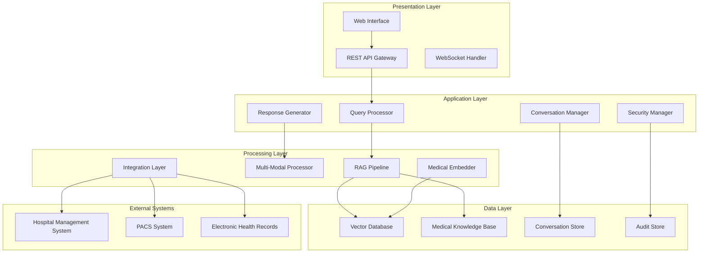

# Design Document: Medical AI RAG Bot

## Overview

The Medical AI RAG Bot is a sophisticated healthcare assistant that combines vector database technology with advanced Retrieval-Augmented Generation techniques to provide intelligent medical information retrieval and analysis. The system processes multi-modal medical content (images, reports, literature) and enables natural language interactions for healthcare professionals.

The architecture follows a microservices pattern with specialized components for embedding generation, vector storage, retrieval processing, and response generation. The system emphasizes security, performance, and medical accuracy while maintaining HIPAA compliance throughout all operations.

## Architecture

The system employs a layered architecture with the following key components:



### Core Processing Flow

1. **Patient Context Loading**: When a patient is selected, the system automatically retrieves and displays key findings from patient records as the default view
2. **Query Ingestion**: User queries enter through the API Gateway and are processed by the Query Processor
3. **Intent Analysis**: The Query Processor analyzes medical intent and extracts relevant entities
4. **Retrieval Phase**: The RAG Pipeline performs multi-stage retrieval from the Vector Database, incorporating patient context
5. **Context Assembly**: Retrieved information is combined with conversation context and patient-specific data
6. **Response Generation**: The Response Generator synthesizes a comprehensive medical response
7. **Security Validation**: All operations are validated through the Security Manager

### Default Patient Summary Display

When a healthcare professional accesses a patient's record, the system proactively displays:
- **Critical Alerts**: Active allergies, drug interactions, and urgent conditions
- **Recent Findings**: Latest lab results, imaging findings, and clinical observations
- **Treatment Status**: Current medications, ongoing treatments, and care plan updates
- **Risk Indicators**: Calculated risk scores and prognostic indicators
- **Similar Cases**: Relevant historical cases for comparison and learning

## Components and Interfaces

### Query Processor

The Query Processor serves as the entry point for all user interactions, responsible for understanding medical queries and preparing them for the RAG pipeline.

**Key Responsibilities:**
- Medical entity recognition and extraction
- Query intent classification (diagnostic, educational, research)
- Query expansion using medical ontologies
- Context preparation for retrieval

**Interface:**
```typescript
interface QueryProcessor {
  processQuery(query: string, context: ConversationContext): ProcessedQuery
  extractMedicalEntities(text: string): MedicalEntity[]
  classifyIntent(query: string): QueryIntent
  expandQuery(query: string): ExpandedQuery
}

interface ProcessedQuery {
  originalQuery: string
  expandedQuery: string
  entities: MedicalEntity[]
  intent: QueryIntent
  priority: QueryPriority
}
```

### RAG Pipeline

The RAG Pipeline implements sophisticated retrieval and generation techniques optimized for medical content.

**Multi-Stage Retrieval Process:**
1. **Initial Retrieval**: Dense vector similarity search across medical embeddings
2. **Hybrid Search**: Combination of semantic and keyword-based retrieval
3. **Re-ranking**: Medical relevance scoring and result prioritization
4. **Context Filtering**: Removal of irrelevant or outdated information

**Interface:**
```typescript
interface RAGPipeline {
  retrieve(query: ProcessedQuery): RetrievalResult[]
  rerank(results: RetrievalResult[], query: ProcessedQuery): RankedResult[]
  generateResponse(context: RetrievalContext): MedicalResponse
}

interface RetrievalResult {
  content: MedicalContent
  similarity: number
  source: ContentSource
  metadata: ContentMetadata
}
```

### Multi-Modal Processor

Handles both textual and visual medical content, enabling cross-modal search and analysis.

**Image Processing Capabilities:**
- DICOM format support and metadata extraction
- Medical image feature extraction using specialized encoders
- Cross-modal embedding alignment between images and text
- Spatial relationship preservation for anatomical structures

**Interface:**
```typescript
interface MultiModalProcessor {
  processImage(image: MedicalImage): ImageEmbedding
  processText(text: string): TextEmbedding
  alignModalities(imageEmb: ImageEmbedding, textEmb: TextEmbedding): AlignedEmbedding
  extractImageFeatures(image: MedicalImage): ImageFeatures
}

interface MedicalImage {
  data: Buffer
  format: ImageFormat
  metadata: DICOMMetadata
  annotations?: ImageAnnotation[]
}
```

### Vector Database

Optimized storage and retrieval system for medical embeddings with support for metadata filtering and hybrid search.

**Storage Strategy:**
- Hierarchical indexing by medical specialty and content type
- Temporal indexing for time-sensitive medical information
- Patient-specific namespacing for privacy and access control
- Automatic embedding versioning and migration

**Interface:**
```typescript
interface VectorDatabase {
  store(embedding: MedicalEmbedding, metadata: EmbeddingMetadata): string
  search(query: QueryEmbedding, filters: SearchFilters): SearchResult[]
  hybridSearch(query: HybridQuery): HybridSearchResult[]
  updateEmbedding(id: string, embedding: MedicalEmbedding): boolean
}

interface SearchFilters {
  specialty?: MedicalSpecialty
  contentType?: ContentType
  dateRange?: DateRange
  patientId?: string
  confidenceThreshold?: number
}
```

### Medical Knowledge Base

Curated repository of medical literature, guidelines, and evidence-based information.

**Content Organization:**
- Hierarchical taxonomy based on medical specialties
- Evidence-level classification and source credibility scoring
- Automatic content updates and version management
- Citation tracking and bibliographic information

**Interface:**
```typescript
interface MedicalKnowledgeBase {
  searchLiterature(query: LiteratureQuery): LiteratureResult[]
  getGuidelines(condition: MedicalCondition): ClinicalGuideline[]
  getDrugInformation(medication: string): DrugInformation
  getCitations(contentId: string): Citation[]
}

interface LiteratureResult {
  title: string
  authors: string[]
  journal: string
  publicationDate: Date
  evidenceLevel: EvidenceLevel
  abstract: string
  fullText?: string
}
```

### Conversation Manager

Maintains dialogue context, manages multi-turn conversations, and provides proactive patient information display while ensuring patient privacy.

**Context Management:**
- Session-based conversation tracking
- Patient-specific context isolation
- Automatic context expiration and cleanup
- Reference resolution across conversation turns
- **Proactive Summary Generation**: Automatic display of key patient findings when patient context is loaded

**Default Patient Information Display:**
- Critical alerts and safety information presented immediately upon patient selection
- Intelligent summarization of recent medical events and findings
- Risk stratification and prognostic indicators
- Contextual treatment recommendations based on current patient state

**Interface:**
```typescript
interface ConversationManager {
  createSession(userId: string): ConversationSession
  updateContext(sessionId: string, context: ConversationContext): void
  getContext(sessionId: string): ConversationContext
  resolveReferences(query: string, context: ConversationContext): ResolvedQuery
  generatePatientSummary(patientId: string): PatientSummary
  getKeyFindings(patientId: string): KeyFinding[]
}

interface PatientSummary {
  patientId: string
  criticalAlerts: CriticalAlert[]
  recentFindings: RecentFinding[]
  treatmentStatus: TreatmentStatus
  riskIndicators: RiskIndicator[]
  similarCases: SimilarCase[]
  generatedAt: Date
}

interface KeyFinding {
  type: FindingType
  description: string
  severity: SeverityLevel
  date: Date
  source: string
  actionRequired?: string
}

interface ConversationContext {
  sessionId: string
  userId: string
  currentPatient?: PatientContext
  conversationHistory: ConversationTurn[]
  activeTopics: MedicalTopic[]
}
```

### Security Manager

Ensures HIPAA compliance, data privacy, and secure access control throughout the system.

**Security Features:**
- End-to-end encryption for all medical data
- Role-based access control with fine-grained permissions
- Comprehensive audit logging and compliance reporting
- Automatic data anonymization and pseudonymization

**Interface:**
```typescript
interface SecurityManager {
  authenticate(credentials: UserCredentials): AuthenticationResult
  authorize(user: User, resource: Resource, action: Action): boolean
  encrypt(data: SensitiveData): EncryptedData
  anonymize(patientData: PatientData): AnonymizedData
  auditLog(event: SecurityEvent): void
}

interface SecurityEvent {
  userId: string
  action: string
  resource: string
  timestamp: Date
  ipAddress: string
  success: boolean
}
```

## Data Models

### Core Medical Entities

```typescript
interface MedicalEmbedding {
  id: string
  vector: number[]
  contentType: ContentType
  specialty: MedicalSpecialty
  createdAt: Date
  version: string
}

interface MedicalContent {
  id: string
  type: ContentType
  title: string
  content: string
  metadata: ContentMetadata
  embeddings: MedicalEmbedding[]
}

interface PatientData {
  patientId: string
  demographics: PatientDemographics
  medicalHistory: MedicalHistory[]
  currentConditions: MedicalCondition[]
  medications: Medication[]
  allergies: Allergy[]
}

interface MedicalCondition {
  code: string
  name: string
  severity: ConditionSeverity
  onsetDate?: Date
  status: ConditionStatus
  evidence: ClinicalEvidence[]
}
```

### Query and Response Models

```typescript
interface MedicalQuery {
  id: string
  text: string
  type: QueryType
  priority: QueryPriority
  context: QueryContext
  timestamp: Date
}

interface MedicalResponse {
  queryId: string
  content: string
  sources: ContentSource[]
  confidence: number
  evidenceLevel: EvidenceLevel
  citations: Citation[]
  generatedAt: Date
}

interface ContentSource {
  id: string
  type: SourceType
  title: string
  authors?: string[]
  publicationDate?: Date
  url?: string
  credibilityScore: number
}
```

### Integration Models

```typescript
interface HL7Message {
  messageType: string
  sendingApplication: string
  receivingApplication: string
  timestamp: Date
  patientId: string
  content: any
}

interface DICOMMetadata {
  studyInstanceUID: string
  seriesInstanceUID: string
  sopInstanceUID: string
  patientId: string
  studyDate: Date
  modality: string
  bodyPart: string
}

interface EHRRecord {
  recordId: string
  patientId: string
  recordType: string
  content: any
  lastModified: Date
  provider: string
}
```

## Correctness Properties

*A property is a characteristic or behavior that should hold true across all valid executions of a system—essentially, a formal statement about what the system should do. Properties serve as the bridge between human-readable specifications and machine-verifiable correctness guarantees.*

Based on the requirements analysis, the following correctness properties ensure the Medical AI RAG Bot operates reliably and accurately:

### Property 1: Multi-Modal Embedding Generation
*For any* valid medical content (text documents, medical images), the Medical_Embedder should generate embeddings with consistent dimensionality and preserve content-specific features that enable semantic similarity matching.
**Validates: Requirements 1.1, 1.2, 3.1**

### Property 2: Metadata and Relationship Preservation
*For any* medical content with associated metadata (patient IDs, timestamps, spatial/temporal relationships), storing and retrieving the content should preserve all metadata associations and relationships without corruption or loss.
**Validates: Requirements 1.3, 3.4, 3.5**

### Property 3: Comprehensive Search Functionality
*For any* search query, the system should support both hybrid search (combining vector similarity and keyword matching) and cross-modal search (finding images from text queries and vice versa) with results ranked by relevance.
**Validates: Requirements 1.5, 3.3**

### Property 4: Query Processing and Expansion
*For any* medical query, the Query_Processor should extract medical entities, classify intent, decompose complex queries into sub-queries, and expand queries using medical ontologies while preserving the original query meaning.
**Validates: Requirements 2.1, 2.4, 2.5**

### Property 5: Multi-Stage Retrieval Pipeline
*For any* processed query, the RAG_Pipeline should perform multi-stage retrieval with initial candidate selection followed by re-ranking, resulting in improved relevance scores compared to single-stage retrieval.
**Validates: Requirements 2.2**

### Property 6: Medical Report and Image Linking
*For any* medical report containing references to imaging studies, the Multi_Modal_Processor should correctly identify and establish bidirectional links between the textual references and corresponding image data.
**Validates: Requirements 3.2**

### Property 7: Knowledge Base Content and Versioning
*For any* update to the Medical_Knowledge_Base, the system should maintain version control, track source credibility, prioritize recent high-impact sources in retrieval, and provide complete bibliographic information with evidence levels.
**Validates: Requirements 4.2, 4.3, 4.5**

### Property 8: Medical Taxonomy Organization
*For any* content stored in the Medical_Knowledge_Base, it should be organized according to medical taxonomies and ontologies, enabling hierarchical browsing and specialty-specific retrieval.
**Validates: Requirements 4.4**

### Property 9: Conversation Context Management and Proactive Display
*For any* patient record access, the system should automatically display key findings (critical alerts, recent results, treatment status), and for any multi-turn conversation, the Conversation_Manager should maintain dialogue history, resolve references across turns, and ensure complete context isolation when switching between patients to prevent information leakage.
**Validates: Requirements 5.1, 5.2, 5.3**

### Property 10: Natural Language Understanding and Adaptation
*For any* user query in medical terminology or clinical language, the system should understand the query and adapt response communication style based on the user's role and expertise level.
**Validates: Requirements 5.5, 5.6**

### Property 11: Query Prioritization Under Load
*For any* set of concurrent queries with different urgency indicators, the system should process higher priority queries first while maintaining fairness for lower priority requests.
**Validates: Requirements 6.4**

### Property 12: Response Streaming
*For any* long-form content generation request, the system should provide streaming responses rather than waiting for complete generation, enabling progressive content delivery.
**Validates: Requirements 6.5**

### Property 13: Comprehensive Security and Encryption
*For any* patient data handled by the system, the Security_Manager should encrypt data using AES-256, implement role-based access control with audit logging, and ensure proper anonymization or pseudonymization of patient identifiers.
**Validates: Requirements 7.1, 7.2, 7.3**

### Property 14: Data Lifecycle Management
*For any* stored data, the Security_Manager should automatically apply retention policies and perform secure deletion according to configured schedules, ensuring no recoverable traces remain after deletion.
**Validates: Requirements 7.4**

### Property 15: Standards-Compliant Integration
*For any* external system integration, the Integration_Layer should conform to relevant standards (HL7 FHIR for HMS, REST principles for APIs) and maintain data synchronization with real-time updates.
**Validates: Requirements 8.1, 8.3, 8.4**

### Property 16: Graceful Integration Failure Handling
*For any* integration failure with external systems, the Integration_Layer should implement fallback mechanisms, provide detailed error reporting, and maintain system stability without cascading failures.
**Validates: Requirements 8.5**

### Property 17: Comprehensive Case Analysis
*For any* patient case analysis request, the Medical_AI_Bot should identify similar historical cases, rank differential diagnoses with confidence scores, highlight case similarities and differences, provide evidence-based treatment recommendations, and include relevant risk factors and prognostic indicators.
**Validates: Requirements 9.1, 9.2, 9.3, 9.4, 9.5**

### Property 18: Educational Content Completeness
*For any* educational query about medical conditions, the system should provide comprehensive explanations including epidemiology, pathophysiology, current treatments, multiple learning resources, authoritative citations, and evidence quality indicators.
**Validates: Requirements 10.1, 10.2, 10.5**

### Property 19: Research Support and Literature Synthesis
*For any* research query, the system should identify relevant literature, synthesize findings across multiple studies, and generate case-based learning scenarios with clinical reasoning exercises.
**Validates: Requirements 10.3, 10.4**

## Error Handling

The Medical AI RAG Bot implements comprehensive error handling strategies to ensure system reliability and user safety:

### Input Validation and Sanitization
- **Medical Content Validation**: All uploaded medical content undergoes format validation, malware scanning, and content integrity checks
- **Query Sanitization**: User queries are sanitized to prevent injection attacks while preserving medical terminology
- **Image Format Verification**: Medical images are validated for proper DICOM format and metadata completeness

### Graceful Degradation
- **Partial Retrieval Handling**: When vector database queries return incomplete results, the system provides partial responses with clear indicators of information gaps
- **Multi-Modal Fallback**: If image processing fails, the system falls back to text-only analysis with appropriate user notification
- **Knowledge Base Unavailability**: When external medical databases are unavailable, the system uses cached local knowledge with timestamp indicators

### Error Recovery and Retry Logic
- **Transient Failure Recovery**: Automatic retry with exponential backoff for temporary network or service failures
- **Circuit Breaker Pattern**: Prevents cascading failures by temporarily disabling failing external integrations
- **State Recovery**: Conversation context and user sessions are preserved across system restarts

### Medical Safety Considerations
- **Confidence Thresholds**: Responses below medical confidence thresholds are flagged with appropriate disclaimers
- **Uncertainty Communication**: Clear indication when the system cannot provide reliable medical information
- **Emergency Escalation**: Automatic escalation protocols for queries indicating medical emergencies

## Testing Strategy

The testing approach combines traditional unit testing with property-based testing to ensure comprehensive coverage and medical accuracy:

### Unit Testing Approach
Unit tests focus on specific examples, edge cases, and integration points:
- **Component Integration**: Testing interfaces between major system components
- **Medical Entity Recognition**: Specific examples of medical term extraction and classification
- **Security Boundary Testing**: Edge cases for authentication, authorization, and data access
- **Error Condition Handling**: Specific failure scenarios and recovery mechanisms

### Property-Based Testing Configuration
Property-based testing validates universal properties across all inputs using **Hypothesis** (Python) or **fast-check** (TypeScript):
- **Minimum 100 iterations** per property test to ensure comprehensive input coverage
- **Medical Data Generators**: Custom generators for realistic medical content, patient data, and clinical scenarios
- **Cross-Modal Consistency**: Properties ensuring consistency between text and image processing
- **Security Invariants**: Properties verifying security constraints hold across all operations

### Property Test Implementation
Each correctness property must be implemented as a property-based test with the following tag format:
**Feature: medical-ai-rag-bot, Property {number}: {property_text}**

Example property test structure:
```python
@given(medical_content=medical_content_generator())
def test_embedding_generation_consistency(medical_content):
    """Feature: medical-ai-rag-bot, Property 1: Multi-Modal Embedding Generation"""
    embedding = medical_embedder.generate_embedding(medical_content)
    assert embedding.dimension == EXPECTED_DIMENSION
    assert embedding.preserves_semantic_features(medical_content)
```

### Medical Accuracy Validation
- **Clinical Expert Review**: Regular review of system responses by medical professionals
- **Evidence-Based Validation**: Automated checking of medical claims against authoritative sources
- **Bias Detection**: Testing for demographic, geographic, and specialty-specific biases in responses
- **Regulatory Compliance Testing**: Validation against HIPAA, FDA, and other healthcare regulations

### Performance and Load Testing
- **Response Time Validation**: Ensuring query response times meet specified thresholds
- **Concurrent User Testing**: Validating system performance under realistic user loads
- **Vector Database Scaling**: Testing embedding storage and retrieval performance at scale
- **Memory and Resource Monitoring**: Ensuring efficient resource utilization during peak usage

### Integration Testing
- **End-to-End Workflows**: Complete user journey testing from query to response
- **External System Integration**: Testing with mock and real HMS, PACS, and EHR systems
- **Multi-Modal Pipeline Testing**: Validation of complete image and text processing workflows
- **Security Integration Testing**: Comprehensive testing of authentication, authorization, and audit trails