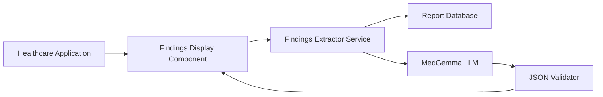

# Design Document: Patient Findings Display

## Overview

The Patient Findings Display system is a lightweight medical findings extraction and visualization component. It follows a simple, direct pipeline architecture: Database → Medical LLM → Structured JSON → Display Component. The system uses MedGemma (a medical-specialized LLM) to process text-based diagnostic reports and extract key findings, which are then displayed in a reusable UI component.

The design prioritizes simplicity, maintainability, and ease of integration. It explicitly avoids heavy architectures like RAG or vector databases, instead relying on direct LLM processing of retrieved reports.

## Architecture

### High-Level Architecture



### Architecture Principles

1. **Direct Pipeline**: No intermediate caching, vector stores, or complex retrieval mechanisms
2. **Stateless Processing**: Each request is independent, no session state required
3. **Component Isolation**: Each layer has clear responsibilities and interfaces
4. **Embeddable Design**: The display component can be dropped into any application
5. **Medical Accuracy**: Use specialized medical LLM for domain-specific understanding

### Data Flow

1. User requests findings for a patient (via patient ID)
2. Findings Display Component calls Findings Extractor Service
3. Findings Extractor queries Report Database for patient's diagnostic reports
4. Retrieved reports are sent to MedGemma LLM with extraction prompt
5. LLM returns extracted findings in JSON format
6. JSON Validator ensures schema compliance
7. Structured findings are returned to Display Component
8. Display Component renders findings in readable format

## Components and Interfaces

### 1. Findings Display Component

**Responsibility**: Render extracted medical findings in a clean, readable format

**Interface**:
```typescript
interface FindingsDisplayProps {
  patientId: string;
  onError?: (error: Error) => void;
  onLoad?: (findings: StructuredFindings) => void;
  className?: string;
}

interface FindingsDisplayComponent {
  render(props: FindingsDisplayProps): ReactElement;
}
```

**Behavior**:
- Accepts patient ID as input
- Internally calls Findings Extractor Service
- Displays loading state during processing
- Renders findings organized by report type
- Highlights abnormal values
- Shows error states when processing fails
- Responsive and accessible design

### 2. Findings Extractor Service

**Responsibility**: Orchestrate report retrieval and LLM processing

**Interface**:
```typescript
interface FindingsExtractorService {
  extractFindings(patientId: string): Promise<StructuredFindings>;
}

interface FindingsExtractorConfig {
  databaseClient: DatabaseClient;
  llmClient: MedGemmaClient;
  jsonValidator: JSONValidator;
}
```

**Behavior**:
- Query database for patient reports
- Format reports for LLM processing
- Call MedGemma with extraction prompt
- Validate returned JSON structure
- Handle errors at each step
- Return structured findings or error

### 3. Report Database Client

**Responsibility**: Retrieve diagnostic reports from existing database

**Interface**:
```typescript
interface DatabaseClient {
  getPatientReports(patientId: string): Promise<DiagnosticReport[]>;
  getReportsByType(patientId: string, reportType: ReportType): Promise<DiagnosticReport[]>;
}

interface DiagnosticReport {
  reportId: string;
  patientId: string;
  reportType: ReportType;
  reportDate: Date;
  reportText: string;
  metadata?: Record<string, any>;
}

enum ReportType {
  BLOOD_TEST = "blood_test",
  RADIOLOGY = "radiology",
  ECG = "ecg"
}
```

**Behavior**:
- Connect to existing patient database
- Query reports by patient ID
- Support filtering by report type
- Return reports in consistent format
- Handle database connection errors

### 4. MedGemma LLM Client

**Responsibility**: Process diagnostic reports using medical-specialized LLM

**Interface**:
```typescript
interface MedGemmaClient {
  extractFindings(reports: DiagnosticReport[]): Promise<string>;
  configure(config: LLMConfig): void;
}

interface LLMConfig {
  modelVersion: string;
  temperature: number;
  maxTokens: number;
  apiEndpoint: string;
  apiKey: string;
}
```

**Behavior**:
- Format reports into LLM prompt
- Call MedGemma API with extraction instructions
- Parse LLM response
- Handle API errors and timeouts
- Return raw JSON string from LLM

**Prompt Template**:
```
You are a medical AI assistant. Extract key findings from the following diagnostic reports.

For each finding, provide:
- Finding name
- Value (if applicable)
- Normal range (if applicable)
- Clinical significance (normal, abnormal, critical)
- Brief interpretation

Return findings in JSON format following this schema:
{
  "findings": [
    {
      "reportType": "blood_test" | "radiology" | "ecg",
      "reportDate": "ISO date string",
      "findingName": "string",
      "value": "string or null",
      "normalRange": "string or null",
      "significance": "normal" | "abnormal" | "critical",
      "interpretation": "string"
    }
  ]
}

Reports:
{report_text}
```

### 5. JSON Validator

**Responsibility**: Validate LLM output against expected schema

**Interface**:
```typescript
interface JSONValidator {
  validate(jsonString: string): ValidationResult;
  getSchema(): JSONSchema;
}

interface ValidationResult {
  isValid: boolean;
  data?: StructuredFindings;
  errors?: ValidationError[];
}

interface ValidationError {
  path: string;
  message: string;
}
```

**Behavior**:
- Parse JSON string from LLM
- Validate against StructuredFindings schema
- Return validation errors if invalid
- Return parsed object if valid

## Data Models

### StructuredFindings

```typescript
interface StructuredFindings {
  patientId: string;
  extractedAt: Date;
  findings: Finding[];
  metadata: FindingsMetadata;
}

interface Finding {
  reportType: ReportType;
  reportDate: Date;
  findingName: string;
  value: string | null;
  normalRange: string | null;
  significance: Significance;
  interpretation: string;
}

enum Significance {
  NORMAL = "normal",
  ABNORMAL = "abnormal",
  CRITICAL = "critical"
}

interface FindingsMetadata {
  totalReportsProcessed: number;
  processingTimeMs: number;
  llmModelVersion: string;
}
```

### Error Types

```typescript
interface FindingsError extends Error {
  code: ErrorCode;
  details?: any;
}

enum ErrorCode {
  DATABASE_ERROR = "DATABASE_ERROR",
  LLM_ERROR = "LLM_ERROR",
  VALIDATION_ERROR = "VALIDATION_ERROR",
  NO_REPORTS_FOUND = "NO_REPORTS_FOUND",
  INVALID_PATIENT_ID = "INVALID_PATIENT_ID"
}
```


## Correctness Properties

*A property is a characteristic or behavior that should hold true across all valid executions of a system—essentially, a formal statement about what the system should do. Properties serve as the bridge between human-readable specifications and machine-verifiable correctness guarantees.*

### Property 1: Complete Report Retrieval

*For any* patient ID with associated diagnostic reports in the database, querying for that patient should return all reports of all supported types (blood test, radiology, ECG) with consistent text format.

**Validates: Requirements 1.1, 1.2, 1.4**

### Property 2: LLM Extraction Produces Findings

*For any* set of diagnostic reports provided to the Medical_LLM, the extraction process should return findings data (may be empty if no findings detected, but should not fail).

**Validates: Requirements 2.2**

### Property 3: Error Messages on Failure

*For any* processing failure (database, LLM, or validation), the Findings_Extractor should return a descriptive error message rather than crashing or returning undefined.

**Validates: Requirements 2.4**

### Property 4: Valid JSON Output

*For any* successful extraction, the Findings_Extractor output should be valid, parseable JSON.

**Validates: Requirements 3.1**

### Property 5: Required Fields Present

*For any* structured findings output, all required fields should be present: finding type, value, normal range, clinical significance, report date, and report type.

**Validates: Requirements 3.2, 3.4**

### Property 6: Findings Organization

*For any* structured findings with multiple findings from different report types, the findings should be organized or grouped by report type.

**Validates: Requirements 3.3**

### Property 7: Schema Validation Rejection

*For any* invalid JSON that doesn't match the StructuredFindings schema, the JSON validator should reject it and return validation errors.

**Validates: Requirements 3.5**

### Property 8: Text Rendering from Structured Data

*For any* valid StructuredFindings object, the Findings_Display_Component should render it as readable text output.

**Validates: Requirements 4.1**

### Property 9: Abnormal Value Highlighting

*For any* finding with significance marked as "abnormal" or "critical", the rendered output should include visual highlighting (CSS class or styling).

**Validates: Requirements 4.2**

### Property 10: Display Organization by Type

*For any* findings from multiple report types, the displayed text should group findings by report type.

**Validates: Requirements 4.3**

### Property 11: Report Type Indication

*For any* finding in the structured output, the reportType field should be present and indicate the source report type.

**Validates: Requirements 7.5**

### Property 12: Database Error Handling

*For any* database query failure, the system should catch the error, return an error message, and not crash.

**Validates: Requirements 8.1**

### Property 13: LLM Error Handling

*For any* LLM processing failure, the system should catch the error, log it, and return a user-friendly error message.

**Validates: Requirements 8.2**

### Property 14: Invalid JSON Handling

*For any* invalid JSON generated by the LLM, the validator should catch it and handle the error gracefully.

**Validates: Requirements 8.3**

### Property 15: Component Error State

*For any* malformed data received by the display component, the component should render an error state rather than crashing.

**Validates: Requirements 8.4**

### Property 16: Error Logging

*For any* error that occurs in the system, the error should be logged with relevant details.

**Validates: Requirements 8.5**

### Property 17: Component Data Fetching

*For any* patient ID provided to the Findings_Display_Component, mounting the component should trigger a data fetch request for that patient.

**Validates: Requirements 5.3**

## Error Handling

### Database Layer Errors

**Connection Failures**:
- Catch database connection errors
- Return `FindingsError` with code `DATABASE_ERROR`
- Include connection details in error message (without sensitive info)
- Log full error for debugging

**Query Failures**:
- Catch query execution errors
- Return `FindingsError` with code `DATABASE_ERROR`
- Include patient ID in error details
- Retry transient errors (timeouts) with exponential backoff

**No Results**:
- Return empty array when no reports found
- Do not treat as error condition
- Log informational message

### LLM Layer Errors

**API Failures**:
- Catch HTTP errors from MedGemma API
- Return `FindingsError` with code `LLM_ERROR`
- Include status code and error message
- Implement retry logic for 5xx errors
- Fail fast on 4xx errors (bad request, auth)

**Timeout Errors**:
- Set reasonable timeout (30 seconds)
- Catch timeout exceptions
- Return `FindingsError` with code `LLM_ERROR`
- Log timeout duration and request details

**Malformed Response**:
- Catch JSON parsing errors
- Return `FindingsError` with code `LLM_ERROR`
- Include snippet of malformed response in logs
- Do not expose raw LLM output to user

### Validation Layer Errors

**Schema Validation Failures**:
- Catch validation errors from JSON validator
- Return `FindingsError` with code `VALIDATION_ERROR`
- Include specific validation errors (field paths)
- Log full validation report

**Type Mismatches**:
- Validate field types match schema
- Return detailed error messages
- Do not attempt type coercion

### Component Layer Errors

**Network Errors**:
- Catch fetch/axios errors
- Display user-friendly error message
- Provide retry button
- Log error details

**Rendering Errors**:
- Use React Error Boundary
- Display fallback UI
- Log error to error tracking service
- Prevent parent component crashes

**Invalid Props**:
- Validate props on component mount
- Show error state for invalid patient ID
- Log validation errors

### Error Response Format

All errors should follow consistent format:

```typescript
interface ErrorResponse {
  error: {
    code: ErrorCode;
    message: string;
    details?: any;
    timestamp: Date;
  };
}
```

## Testing Strategy

### Dual Testing Approach

This feature requires both unit tests and property-based tests for comprehensive coverage:

- **Unit Tests**: Verify specific examples, edge cases, and error conditions
- **Property Tests**: Verify universal properties across all inputs using randomized testing

Both approaches are complementary and necessary. Unit tests catch concrete bugs in specific scenarios, while property tests verify general correctness across a wide range of inputs.

### Property-Based Testing

**Library**: Use `fast-check` for TypeScript/JavaScript property-based testing

**Configuration**:
- Minimum 100 iterations per property test
- Each test must reference its design document property
- Tag format: `Feature: patient-findings-display, Property N: [property description]`

**Test Organization**:
```
src/__tests__/
  findings-extractor.property.test.ts
  database-client.property.test.ts
  medgemma-client.property.test.ts
  json-validator.property.test.ts

frontend/src/__tests__/
  FindingsDisplay.property.test.tsx
```

**Example Property Test**:
```typescript
// Feature: patient-findings-display, Property 1: Complete Report Retrieval
import * as fc from 'fast-check';

test('database returns all reports for a patient', async () => {
  fc.assert(
    fc.asyncProperty(
      fc.string({ minLength: 5 }), // patient ID
      fc.array(arbitraryDiagnosticReport(), { minLength: 1, maxLength: 10 }),
      async (patientId, reports) => {
        // Setup: store reports in database
        await dbClient.storeReports(reports.map(r => ({ ...r, patientId })));
        
        // Execute: query for patient reports
        const retrieved = await dbClient.getPatientReports(patientId);
        
        // Verify: all reports returned
        expect(retrieved.length).toBe(reports.length);
        expect(retrieved.map(r => r.reportId).sort())
          .toEqual(reports.map(r => r.reportId).sort());
      }
    ),
    { numRuns: 100 }
  );
});
```

### Unit Testing

**Focus Areas**:
- Specific examples demonstrating correct behavior
- Edge cases (empty reports, single finding, no findings)
- Error conditions (database failures, LLM timeouts, invalid JSON)
- Integration points between components

**Test Organization**:
```
src/__tests__/
  findings-extractor.test.ts
  database-client.test.ts
  medgemma-client.test.ts
  json-validator.test.ts

frontend/src/__tests__/
  FindingsDisplay.test.tsx
```

**Example Unit Tests**:
```typescript
describe('FindingsExtractorService', () => {
  test('returns empty findings when no reports exist', async () => {
    const service = new FindingsExtractorService(mockDb, mockLLM, mockValidator);
    mockDb.getPatientReports.mockResolvedValue([]);
    
    const result = await service.extractFindings('patient-123');
    
    expect(result.findings).toEqual([]);
  });

  test('handles database connection failure', async () => {
    const service = new FindingsExtractorService(mockDb, mockLLM, mockValidator);
    mockDb.getPatientReports.mockRejectedValue(new Error('Connection failed'));
    
    await expect(service.extractFindings('patient-123'))
      .rejects.toThrow('DATABASE_ERROR');
  });

  test('processes blood test report correctly', async () => {
    const service = new FindingsExtractorService(mockDb, mockLLM, mockValidator);
    const bloodReport = {
      reportId: '1',
      patientId: 'patient-123',
      reportType: ReportType.BLOOD_TEST,
      reportDate: new Date('2024-01-15'),
      reportText: 'Hemoglobin: 12.5 g/dL (Normal: 13.5-17.5)'
    };
    
    mockDb.getPatientReports.mockResolvedValue([bloodReport]);
    mockLLM.extractFindings.mockResolvedValue(JSON.stringify({
      findings: [{
        reportType: 'blood_test',
        reportDate: '2024-01-15',
        findingName: 'Hemoglobin',
        value: '12.5 g/dL',
        normalRange: '13.5-17.5 g/dL',
        significance: 'abnormal',
        interpretation: 'Below normal range'
      }]
    }));
    
    const result = await service.extractFindings('patient-123');
    
    expect(result.findings).toHaveLength(1);
    expect(result.findings[0].findingName).toBe('Hemoglobin');
    expect(result.findings[0].significance).toBe('abnormal');
  });
});
```

### Integration Testing

**Component Integration**:
- Test Findings Display Component with real API calls (mocked with MSW)
- Verify loading states and transitions
- Test error recovery and retry logic
- Verify accessibility compliance

**Service Integration**:
- Test FindingsExtractorService with real database (test container)
- Test with real MedGemma API (or mock server)
- Verify end-to-end data flow
- Test error propagation

**Example Integration Test**:
```typescript
describe('FindingsDisplay Integration', () => {
  test('displays findings for patient with reports', async () => {
    // Setup MSW to mock API
    server.use(
      rest.get('/api/findings/:patientId', (req, res, ctx) => {
        return res(ctx.json({
          patientId: 'patient-123',
          extractedAt: new Date(),
          findings: [
            {
              reportType: 'blood_test',
              reportDate: new Date('2024-01-15'),
              findingName: 'Hemoglobin',
              value: '12.5 g/dL',
              normalRange: '13.5-17.5 g/dL',
              significance: 'abnormal',
              interpretation: 'Below normal range'
            }
          ],
          metadata: {
            totalReportsProcessed: 1,
            processingTimeMs: 250,
            llmModelVersion: 'medgemma-v1'
          }
        }));
      })
    );
    
    render(<FindingsDisplay patientId="patient-123" />);
    
    // Verify loading state
    expect(screen.getByText(/loading/i)).toBeInTheDocument();
    
    // Wait for findings to load
    await waitFor(() => {
      expect(screen.getByText(/Hemoglobin/i)).toBeInTheDocument();
    });
    
    // Verify abnormal highlighting
    const findingElement = screen.getByText(/Hemoglobin/i).closest('div');
    expect(findingElement).toHaveClass('abnormal');
  });
});
```

### Test Data Generators

**For Property-Based Tests**:
```typescript
import * as fc from 'fast-check';

export const arbitraryPatientId = (): fc.Arbitrary<string> =>
  fc.string({ minLength: 5, maxLength: 50 });

export const arbitraryReportType = (): fc.Arbitrary<ReportType> =>
  fc.constantFrom(
    ReportType.BLOOD_TEST,
    ReportType.RADIOLOGY,
    ReportType.ECG
  );

export const arbitraryDiagnosticReport = (): fc.Arbitrary<DiagnosticReport> =>
  fc.record({
    reportId: fc.uuid(),
    patientId: arbitraryPatientId(),
    reportType: arbitraryReportType(),
    reportDate: fc.date({ min: new Date('2020-01-01'), max: new Date() }),
    reportText: fc.lorem({ maxCount: 10 }),
    metadata: fc.option(fc.dictionary(fc.string(), fc.anything()))
  });

export const arbitrarySignificance = (): fc.Arbitrary<Significance> =>
  fc.constantFrom(
    Significance.NORMAL,
    Significance.ABNORMAL,
    Significance.CRITICAL
  );

export const arbitraryFinding = (): fc.Arbitrary<Finding> =>
  fc.record({
    reportType: arbitraryReportType(),
    reportDate: fc.date({ min: new Date('2020-01-01'), max: new Date() }),
    findingName: fc.string({ minLength: 3, maxLength: 50 }),
    value: fc.option(fc.string({ minLength: 1, maxLength: 20 })),
    normalRange: fc.option(fc.string({ minLength: 1, maxLength: 30 })),
    significance: arbitrarySignificance(),
    interpretation: fc.lorem({ maxCount: 3 })
  });

export const arbitraryStructuredFindings = (): fc.Arbitrary<StructuredFindings> =>
  fc.record({
    patientId: arbitraryPatientId(),
    extractedAt: fc.date(),
    findings: fc.array(arbitraryFinding(), { minLength: 0, maxLength: 20 }),
    metadata: fc.record({
      totalReportsProcessed: fc.nat({ max: 100 }),
      processingTimeMs: fc.nat({ max: 10000 }),
      llmModelVersion: fc.constant('medgemma-v1')
    })
  });
```

### Performance Testing

**Benchmarks**:
- Database query time < 500ms for typical patient (10-50 reports)
- LLM processing time < 5 seconds for batch of 10 reports
- JSON validation time < 50ms
- Component render time < 100ms
- End-to-end request time < 6 seconds

**Load Testing**:
- Test with patients having 100+ reports
- Test concurrent requests (10+ simultaneous users)
- Verify graceful degradation under load
- Monitor memory usage during processing

### Accessibility Testing

**Component Accessibility**:
- Verify keyboard navigation works
- Test with screen readers (NVDA, JAWS)
- Ensure proper ARIA labels for loading/error states
- Verify color contrast ratios for abnormal highlighting
- Test with browser zoom (up to 200%)
- Ensure text field is properly labeled

**WCAG 2.1 Compliance**:
- Level AA compliance minimum
- Focus indicators visible
- Error messages associated with inputs
- Sufficient color contrast (4.5:1 for normal text)
